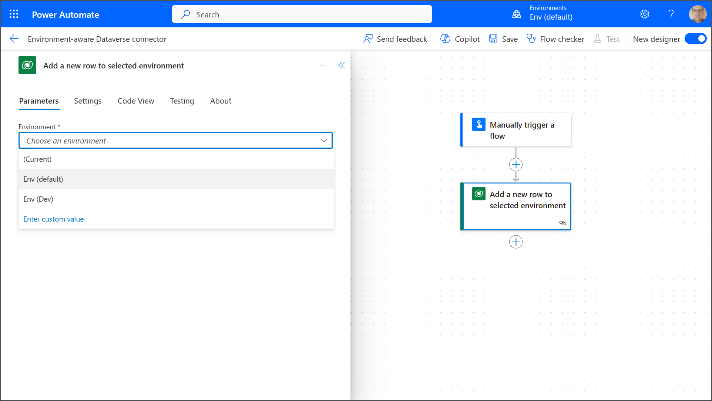

|Article title|Release date (dd.mm.yyyy)|Update date (dd.mm.yyyy)|Version|Author|Tags|Functionality deployment status|
|:----:|:----:|:----:|:----:|:----:|:----:|:----:|
|Environment-aware Dataverse connector| 04.01.2024 |04.01.2024 |1.0 | GitHub: [Andrzej Bożyk](https://www.github.com/abozyk1990)  X: [@BozykAndrzej](https://twitter.com/BozykAndrzej) Linkedin: [Andrzej Bożyk](https://www.linkedin.com/in/andrzej-bo%C5%BCyk-a4b67a145/) | Power Automate, Dataverse | Preview

## Introduction :pencil:

Power Automate Dataverse connector now supports environment selection :heart_eyes: No more copying data to environment where your main app is located or using environment-aware Microsoft Dataverse (legacy) connector. Everything is simple and fast to implement, but before we will get jump into the details, let's think...

## What is connector :grey_question:
Connector is essence of each Power Platform solution. Every time when you work with data, you work with connector. Every time when you send email, you work with connector. Every time when something happens automatically, you work with connector. Other words connector is your window to the world of actions and data. It allows us to simplify work (thanks to list of predefined operations), establish secured connection to data source and protect data against unauthorized usage.

We can specify two operation types, which are part of the connector: 
- Trigger - it's a call for action, when something happened. It wait for some particular event to occur and then fire e.g. when new record is added to the table. What is more, trigger in flow stores information about added/modified/deleted row. Thanks to that we can easily access data in columns.
- Action - it's execution of some command after something happened e.g. send email when new record is added to the table.

Think about connector as wrapper for predefined triggers and actions. It is very wide and complex topic, but worthy to understand deeply. To read more please visit [Connectors overview](https://learn.microsoft.com/en-us/connectors/connectors) on Microsoft Learn website.

## What is Dataverse connector :loudspeaker:
Now when we have a basic understanding what is connector, let's talk a little bit about main actor of this show.

Dataverse is a low-code, no-code relational database designed for the purpose of Power Platform applications. By using built-in functionalities we can build in short-period of time secured and scalable solutions to store our data. We can design:
- Tables,
- Complex logic,
- Relationships,
- Security roles,
- Views,
- Connection to other tools like Azure Synapse Analytics or Microsoft Fabric,
- Plugins,
- And much, much more.

So let's think :thought_balloon: We have all of these features, which helps us to work with data, but how we can access them from other Power Platform apps? This is a moment when Dataverse connector come into action. It allows us to execute basic <b>C</b>reate, <b>R</b>ead, <b>U</b>pdate, <b>D</b>elete actions. What is more, we can also work with relationships by using "relate" to create relationships between two rows or "unrelate" to break it down, and of course, triggers. The most popular one is "When a row is added, modified or deleted". Most of the time, this range of built-in actions and triggers is enough to meet business requirements.

If you want to deep dive into Dataverse world, you can take a look on [Microsoft Dataverse](https://learn.microsoft.com/en-us/power-apps/maker/data-platform/) on Microsoft Learn website.

## Environment-aware Dataverse triggers :inbox_tray:
- Triggers supporting environment selection are not available. They are going to be delivered in future releases.

## Environment-aware Dataverse actions :calling:
- Add a new row to selected environment
- Delete a row from selected environment
- Download a file or an image from selected environment
- Get a row by ID from selected environment
- List rows from selected environment
- Perform a bound action in selected environment
- Perform an unbound action in selected environment
- Relate rows in selected environment
- Unrelate rows in selected environment
- Update a row from selected environment
- Upload a file or an image to selected environment

## How to use it :wrench: 
Implementation requires three simple steps:
1) Select Microsoft Dataverse from list of available connectors (the same as usual when working with Dataverse),
2) Choose one of the actions with text "selected environment". Those actions support environment selection only.,
3) Pick from drop down your environment, add remaining parameters (which are the same as in version without environment selection) and you are good to go :sparkles: :sparkles: :sparkles:

## Demo :clapper:

##### Prerequisites
- Power Automate Premium license (Dataverse connector is premium),
- Access to two environments with Dataverse database,
- System Customizer to create tables from scratch,
- Good to have knowledge about Dataverse tables design,
- Good to have knowledge about Power Automate in cloud,
- New Power Automate Designer view is on.

> Due to the fact that each environment configuration can be client-specific, contact with local IT is required to grant permissions  :exclamation:

##### Description

In this example we are going to create flow triggered when new record is added to "Budget request" table, check if budget is active based on "Budget" table and automatically reject request if it's not, otherwise send email to approver. To complete the process we will update record status column when reqest is rejected.

##### Tables details

| Table name        | Environment name  | Data type  | Table type | Fields |
|--------------|-----------|------------|------------|------------|
| Budget request | Env (Dev)  | Transactional   |Standard      | - Item description (single line of text) - primary column - <b>key</b> - Department (choice field): &nbsp;&nbsp;&nbsp;&nbsp;&nbsp;&nbsp;&nbsp;- HRO &nbsp;&nbsp;&nbsp;&nbsp;&nbsp;&nbsp;&nbsp;- RTR &nbsp;&nbsp;&nbsp;&nbsp;&nbsp;&nbsp;&nbsp;- CS - Activity type (choice field): &nbsp;&nbsp;&nbsp;&nbsp;&nbsp;&nbsp;&nbsp;- Team integration &nbsp;&nbsp;&nbsp;&nbsp;&nbsp;&nbsp;&nbsp;- Marketing &nbsp;&nbsp;&nbsp;&nbsp;&nbsp;&nbsp;&nbsp;- Car rent - Requested budget (decimal field) - Request status (choice field): &nbsp;&nbsp;&nbsp;&nbsp;&nbsp;&nbsp;&nbsp;- Approved &nbsp;&nbsp;&nbsp;&nbsp;&nbsp;&nbsp;&nbsp;- Rejected |
| Budget| Env (default) | Master data     |Standard      | - Item description (single line of text) - primary column - <b>key</b> - Department (choice field): &nbsp;&nbsp;&nbsp;&nbsp;&nbsp;&nbsp;&nbsp;- HRO &nbsp;&nbsp;&nbsp;&nbsp;&nbsp;&nbsp;&nbsp;- RTR &nbsp;&nbsp;&nbsp;&nbsp;&nbsp;&nbsp;&nbsp;- CS - Activity type (choice field): &nbsp;&nbsp;&nbsp;&nbsp;&nbsp;&nbsp;&nbsp;- Team integration &nbsp;&nbsp;&nbsp;&nbsp;&nbsp;&nbsp;&nbsp;- Marketing &nbsp;&nbsp;&nbsp;&nbsp;&nbsp;&nbsp;&nbsp;- Car rent - Available budget (decimal field) - Active budget (yes/no field)|

##### Data input
Example of "Budget request" data:
| Item Description        | Department     | Activity type | Requested budget | Request status
|:--- |:----:|:----:|:----:|:----:|
| HRO &#124; Team integration | HRO      |Team integration    |1,000.00| Blank |
| CS &#124; Marketing      | CS  | Marketing       |500.00|  Blank |
>Each line is separate request :exclamation:

Example of "Budget" data:
| Item Description        | Department     | Activity type |Available budget|Active budget|
|:--- |:----:|:----:|:----:|:----:|
| HRO &#124; Team integration | HRO      |Team integration    |10,000.00| Yes |
| RTR &#124; Marketing      | RTR  | Marketing       |2000.00| No |

##### Assumptions
- Building front-end is not part of this demo.
- "Budget" table have unique records and all possible budget combinations are added to master data.
- We have relation: 1 ("Budget") to many ("Budget request")
- Purpose of the flow is to do preliminary check, if budget is open or not, to reduce number of requests sent to approver.
- No automatic check if requested budget is below available budget. Process assume, that approver makes decision, if grant budget or not.
- Available budget is manually updated by approver in Budget table, not by flow.

##### Building a Dataverse tables
Tables design is a preliminary action, necessary to build flow in further steps of demo. In the process we use standard table type and basic data types available out-of-the-box in Dataverse. Below videos show how to build "Budget" table step by step. This actions are also applicable to "Budget request". To get full table specification of "Budget request" please refer to "Tables details" and “Data input” paragraphs.

>In this demo primary column name is changed from "Name" to "Item Description". In some scenarios using "Name" might lead to collision with fields names used in process :exclamation:

> Choice fields are local. There is no point to use global approach in case of using field only in one table, unless there are a plans to use this field in other solution or list of choices is long. In this case global approach or even dictionaries should be considered.

https://github.com/abozyk1990/myblog/assets/145839234/830f0749-9cf1-475e-9af9-e17747864c00

https://github.com/abozyk1990/myblog/assets/145839234/661a13b1-c783-4c39-a096-27d6d6d97dfd

https://github.com/abozyk1990/myblog/assets/145839234/e15b6150-31fe-4b42-b21e-810bb5aa2722

##### Building a flow
<b>:one:</b> In first step we are going to use "Automated cloud flows" to create new flow in [Power Automate portal](https://make.powerautomate.com/) and configure trigger. Important part of this step is to start from right environment. Due to the fact that environment-aware triggers are not available yet, we have to use old approach, which requires to have a flow in the same environment where transactional data are. In this scenario it is "Env (Dev)". 

>"Automated cloud flows" allow to use power of trigger and run flows automatically.

>If your Dataverse connection is established signing in steps from video are not required, because existing connection will be used. If not, please follow steps from video. Due to security reasons video is missing one pop-up window where credentials are added.

https://github.com/abozyk1990/myblog/assets/145839234/ebc45bd4-af96-470c-ba81-21059b2a548f

<b>:two:</b> Now it is time for adding flow actions. First one is going to retrieve data from "Budget" table located in different environment. What is more, we have to get only data related to raised request. We don't need information about other budgets. This mean that we have to use OData filter expressions. In our case we have to check only, if any value in "Item Description" column (key) from "Budget" table is equal to "Item Description" (key) from raised request. Information about currently processed request is stored in trigger.

> OData requires technical names of fields and we can't use capital letters in expression :exclamation:

https://github.com/abozyk1990/myblog/assets/145839234/819cb97a-7e85-4f0d-a97f-961fc8dfed25

<b>:three:</b> In this stage we have to make decision if request should be sent to approver or automatically rejected. Power Automate allows to use if statements which check if some condition/s are met and based on this executes some actions. 

Now let's think about the condition, which has to check if budget is active or not. Information about it is in yes/no field named "Active budget". To work with this kind of field in Power Automate we have to remember that we work with boolean field, other words yes = true and no = false.

https://github.com/abozyk1990/myblog/assets/145839234/bf6f5350-0969-4494-99cd-cc83472a27c8

Power Automate has automatically added "For each" loop. It is normal situation, because flow detects that, potentially "List rows from selected environment" action has more than one record.

<b>:four:</b> We are almost there. We have data, logic making decision, so now we have to inform approver or requestor of the decision. To do it we will use Outlook "Send an email (V2)" action.

>If your Outlook connection is not established, please repeat authorization steps in point one.

https://github.com/abozyk1990/myblog/assets/145839234/6af86e9f-b88e-4f6f-a4a0-239870b3bb25

<b>:five:</b> Last but not least is updating "Request status" column in "Budget request" table when request is rejected. To update Dataverse record we can use "Update a row" action. In this place we have to remember about one thing, which is "Row ID". Thanks to this parameter we can select which row we want to update. By default, in Dataverse table, column representing unique identifier has the same name as table. We are going to update "Budget request" table, so name of the parameter is "Budget request" as well. Once again trigger become handy, because we can take this information from there.

https://github.com/abozyk1990/myblog/assets/145839234/98805ca1-bc9b-49e1-a0de-77465bc0e39b

Great :star: :tada: :confetti_ball: We have cross-environmental flow.

>This demo is focusing only on environment-aware Dataverse connector presentation. There are several advanced optimization techniques which allow to improve performance and limit number of actions, which are not in scope of this article.

##### Flow test
Now when we have all pieces, it is time to check if it works. Power Automate has a built-in logs mechanism allowing to check flow run details, directly from the browser. For the purpose of test we will use "RTR | Marketing" case for which budget is blocked.

https://github.com/abozyk1990/myblog/assets/145839234/2b8d8b7a-5b3a-432a-80e9-ad6f999d5c93

Perfect. Flow works according to expectations :smile:

## Conclusions
Environment-aware Dataverse connector is a big step forward in working with and managing data, especially in era of AI, Machine Learning and Data Science where good quality of data is more important than ever.
Smart implementation of environment-aware connector can lead to less data redundancy and higher quality, because why we have to copy data from other environment if we can take them from their directly.
The above presentation is only the tip of an iceberg. We can implement much more scenarios using this new feature, for example, we can integrate tools from many environments, because now we can take data or update tables which belong to solutions located in different environments.
Now, the best thing at the end. We don't have to do anything in existing solutions. Microsoft is going to automatically update already created tools by adding environment parameter, so our solutions are safe and we can think what kind of new automation we can build by using new functionality :smile: 

#### Resources
- <https://learn.microsoft.com/en-gb/power-automate/dataverse/connect-to-other-environments>
- <https://learn.microsoft.com/en-us/power-apps/maker/data-platform/>
- <https://learn.microsoft.com/en-us/connectors/connectors>
